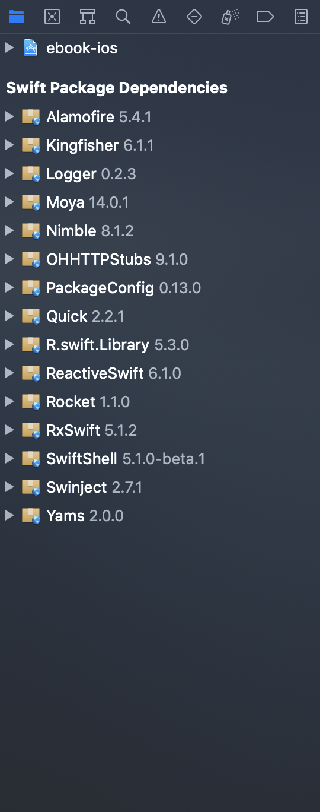

Xcode requis: >= 12.0

# Clonnage du repository:

`git clone https://github.com/ronzierLoic/ebook-ios.git`

# Initialisation du projet

 - Ouvrir le projet `ebook-ios.xcodeproj`.
 - Attendre que SwiftPackageManager récupère les différentes librairies, cela peut prendre un peu de temps la première fois.
 
 
 
 - Run le projet sur un simulateur.
